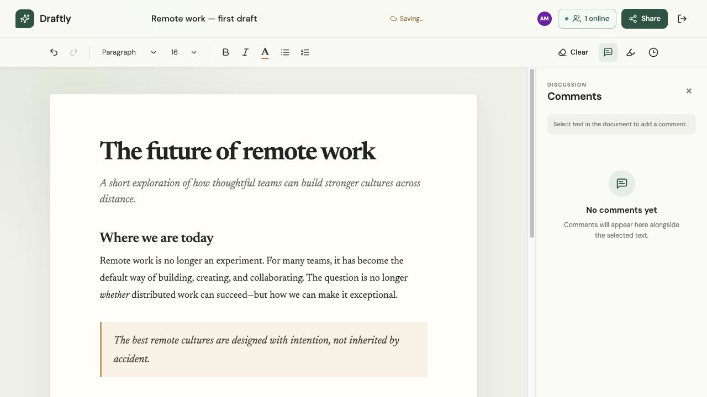
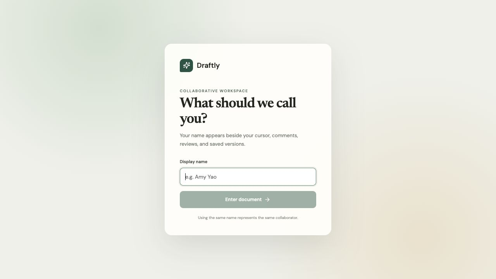
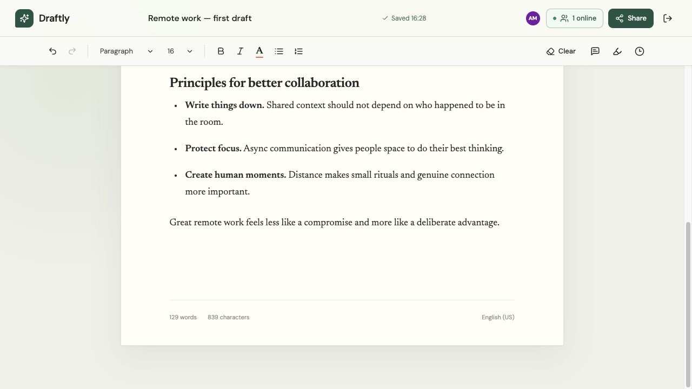
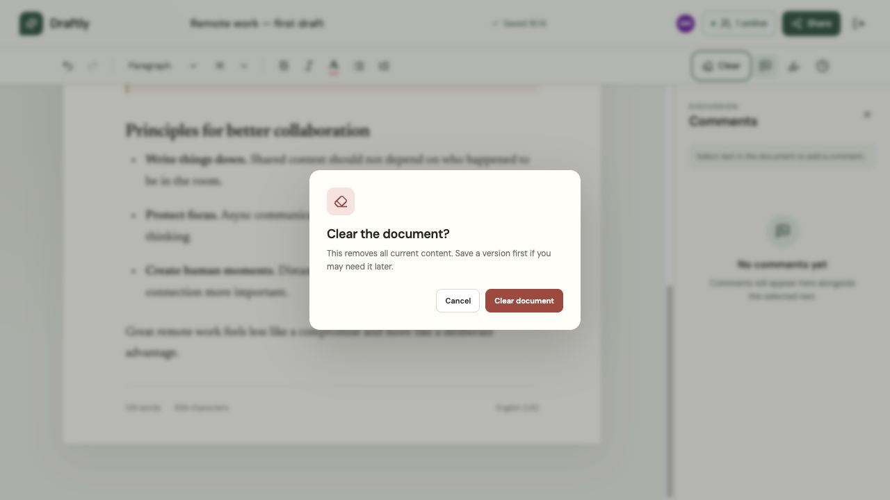
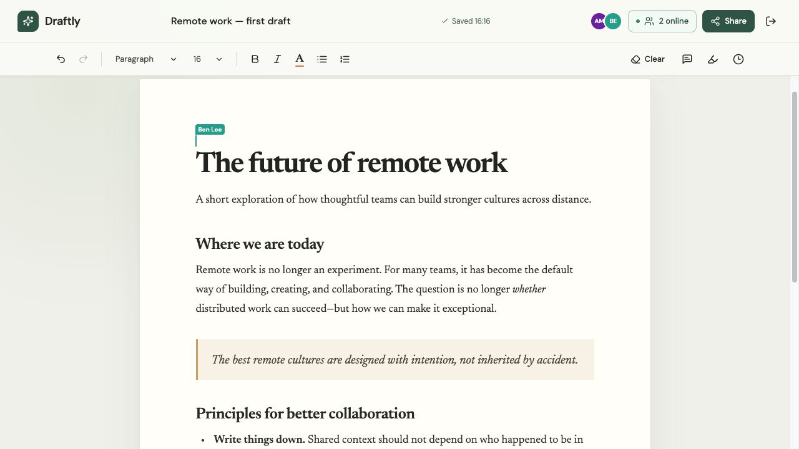
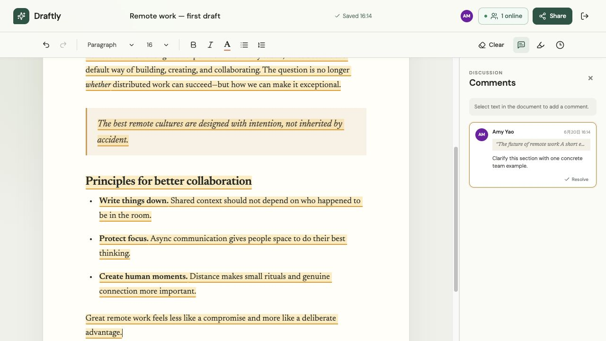
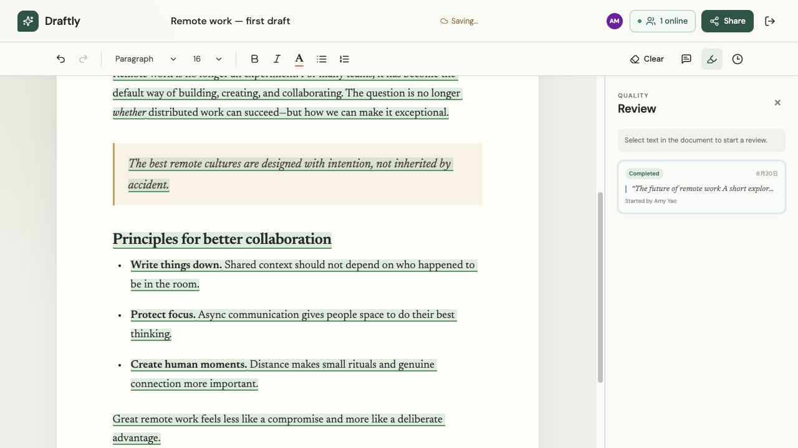
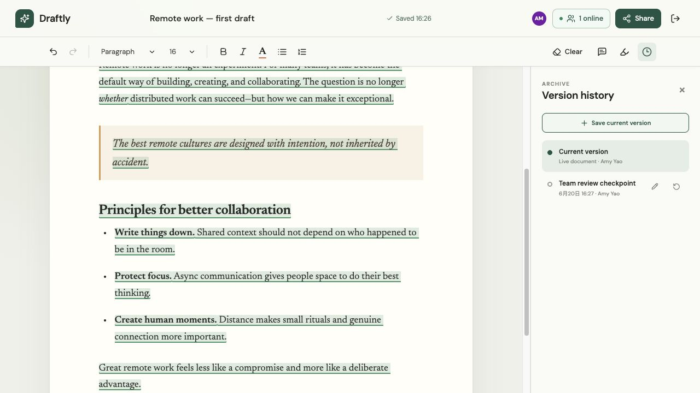
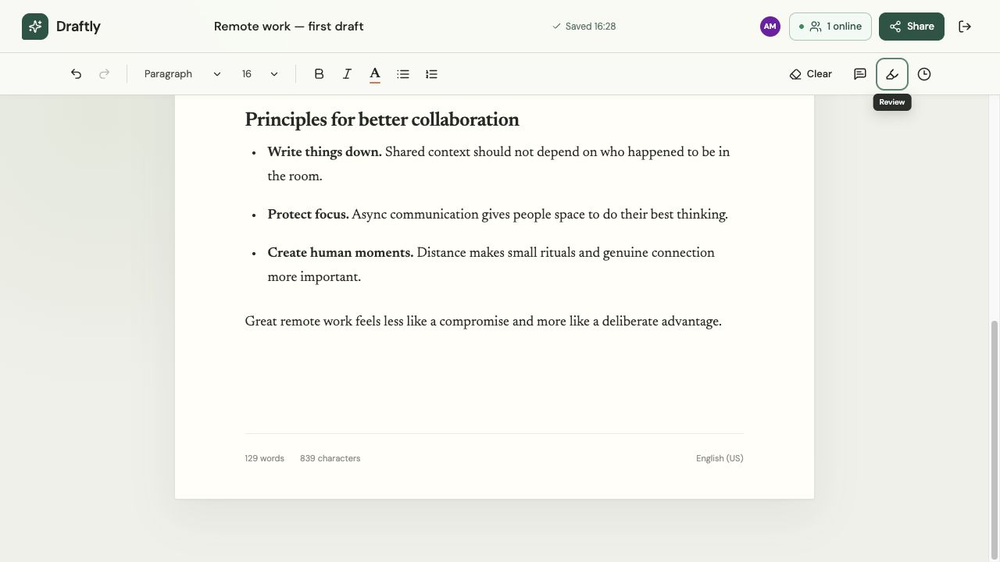

# Text Editor App

A full-stack, real-time collaborative rich-text editor built for a vibe coding assessment.

**Repository:** [github.com/amyao/text-editor-app](https://github.com/amyao/text-editor-app)



## Features

- Rich-text editing with bold, italic, color, font size, headings, paragraphs, and lists
- Clear document action with an in-app confirmation dialog
- Browser-local backup with automatic saving and `Cmd/Ctrl + S`
- Live word and character counts
- Real-time Yjs collaboration over WebSocket
- Live collaborator avatars, connection state, names, colors, and remote carets
- Stable pseudo-random collaborator colors generated across the full hue range to
  minimize collisions
- Required display-name entry before joining a document
- Shareable links that open the same collaborative document room
- Anchored text comments with resolve status
- Review workflow with persistent `in review` and `completed` highlights
- Editable revision names with author/time metadata and one-click restore
- Fixed workspace controls with an independently scrolling document canvas
- Accessible hover tooltips for icon-only actions
- SQLite persistence for documents, Yjs state, comments, reviews, and revisions
- Responsive desktop and mobile layouts

## Feature tour

### Display-name entry

Every participant identifies themselves before joining. Normalized matching names
represent the same collaborator.



### Rich-text editing

The fixed toolbar provides paragraph styles, font size, bold, italic, text color,
bulleted lists, numbered lists, undo, redo, and clear actions.


### Local autosave and live counts

The document is backed up to browser storage after edits and supports
`Cmd/Ctrl + S`. Word and character totals update live while the document scrolls
independently beneath the fixed controls.



### Safe clear action

Clearing the document requires explicit confirmation to prevent accidental data
loss.



### Real-time collaboration

Distinct participant colors are shown consistently in avatars, selections, and
remote carets. This example shows Amy and Ben connected to the same room.



### Anchored comments

Comments retain their quoted text, author, timestamp, document highlight, and
resolved state.



### Review workflow

Selected text can be marked for review. Completed reviews remain visibly
highlighted and available to every collaborator.



### Editable version history

Users can save snapshots, rename them, inspect author/time metadata, and restore
an earlier version.



### Discoverable toolbar actions

Icon-only actions include hover and keyboard-focus tooltips.



## Architecture

```text
Browser
  ├── React + TipTap
  ├── Yjs collaborative document
  ├── localStorage safety backup
  ├── REST API ──────────────────────┐
  └── Hocuspocus WebSocket ───────┐  │
                                 │  │
Node.js server                   │  │
  ├── Hocuspocus ◀───────────────┘  │
  ├── Express ◀─────────────────────┘
  └── SQLite
```

The Yjs document stores rich text, anchored marks, document title metadata, and
collaborator awareness. REST endpoints manage durable comments, review states,
and revision metadata.

## Monorepo structure

```text
text-editor-app/
├── apps/
│   ├── web/        React, TipTap, Yjs, Hocuspocus provider
│   └── server/     Express API, Hocuspocus server, SQLite
├── packages/
│   └── shared/     Shared domain types and constants
├── docs/
│   └── screenshots/
├── data/           Generated SQLite database (gitignored)
└── package.json    npm workspace scripts
```

## Run locally

Requirements:

- Node.js 22 or newer
- npm 10 or newer

```bash
git clone git@github.com:amyao/text-editor-app.git
cd text-editor-app
npm install
npm run dev
```

Open [http://localhost:5173](http://localhost:5173).

The single development command starts:

- Web app: `http://localhost:5173`
- REST API: `http://localhost:3001`
- Collaboration WebSocket: `ws://localhost:1234`

Environment defaults are documented in `.env.example`.

## Test collaboration

1. Start the app with `npm run dev`.
2. Click **Share** to copy the document URL.
3. Open that URL in another browser or private profile.
4. Edit the document in either window.
5. Confirm that text, title, remote caret, comments, and review highlights update
   in the other window.

Each participant enters a display name before joining. The same normalized name
maps to the same collaborator identity and stable pseudo-random color. Different
names are distributed across a broad hue range to reduce color collisions. No
external account or paid collaboration service is required.

## Quality commands

```bash
npm test             # Run automated SQLite/domain persistence tests
npm run build        # Production-build all workspaces
npm run typecheck    # Type-check all workspaces
npm run lint         # Lint the web application
```

## Requirement coverage

| Requirement | Implementation |
| --- | --- |
| Text input and display | TipTap/ProseMirror editor |
| Basic formatting | Toolbar commands and custom font-size extension |
| Clear text | Confirmed clear action |
| Local storage | Debounced HTML safety backup |
| Word count | Live words and characters |
| Multiple users | Yjs + Hocuspocus WebSocket |
| User cursor positions | Collaboration caret and awareness |
| Version history | SQLite snapshots and restore UI |
| Review functionality | Collaborative review marks with completion status |
| Commenting | Anchored comment marks and discussion sidebar |

## Verification status

- Automated tests: 4 passing
- Production build: passing
- TypeScript: passing
- ESLint: passing
- Dependency audit: 0 known vulnerabilities
- Browser acceptance: desktop and 375px mobile layouts verified
